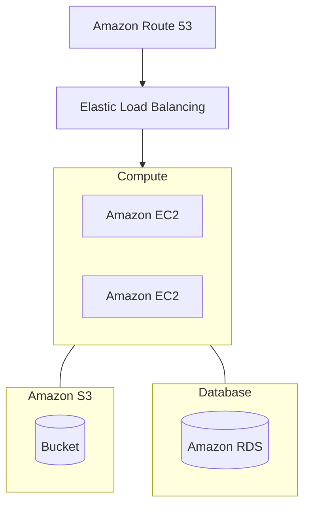

# Complete Terraform Course

[Course on Youtube](https://www.youtube.com/watch?v=7xngnjfIlK4)

 

## Timestamps in Description

1. Evolution of Cloud + Infrastructure as Code (IaC)
2. Terraform Overview + Setup
3. Basic Terraform Usage
4. Variables and Outputs
5. Language Features
6. Project Organization + Modules
7. Managing Multiple Environments
8. Testing Terraform Code
9. Developer Workflows

---

 

## What is Terraform?

> Terraform is a tool for building, changing, and versioning infrastructure safely and efficiently.
> 
> \- According to HashiCorp

 

## Reference Architecture

- Basic web application
- Infrastructure all within AWS
- Multiple instance running on EC2
- Using default VPC for simplicity

 

 

---

 

## Pre-Cloud 1990s -> 2000s

- Operational Overhead가 매우 Challanging했다.
- Capital Expenses를 운영자가 각각 부담해야 했다.
- On Promise -> Cloud (On Demand)

 

### Infrastructure provisioned via APIs

- Infrastructure provisioned via APIs.
- Servers created & destroyed in seconds.
- Long-lived + mutable -> Short-lived + immutable

 

### Provisioning Cloud Resources

#### Three Approaches

- GUI (AWS Consoles, ...)
- API/CLI (AWS CLI, ...)
- IaC (Terraform, Serverless, ...)

코드 베이스로 인프라 프로비저닝이 가능함에 따라 일관된 설정과 구성을 명시적으로 나타내고 관리할 수 있다.

 

## What is Infrastructure as Code (IaC)?

### Categories of IaC tools: [1](#footnote_1)
1. Ad hoc scripts
2. Configuration management tools
3. Server Templating tools
4. Orchestration tools (e.g. Kubernetes)
5. Provisioning tools

- Declarative(선언형) vs. Imperative(명령형)

 

## IaC Provisioning Tools Landscape

### Cloud Specific

- Cloud Formation
- Azure Resource Manager
- Google Cloud Deployment Manager

### Cloud Agnostic

- Terraform
- Pulumi
- Serverless

    

---

<a name="footnote_1">1</a>: From Terraform: Up & Running Writing Infrastructure as Code, Second Edition (O'Reilly Media, 2019) by Yevgeniy Brickman
